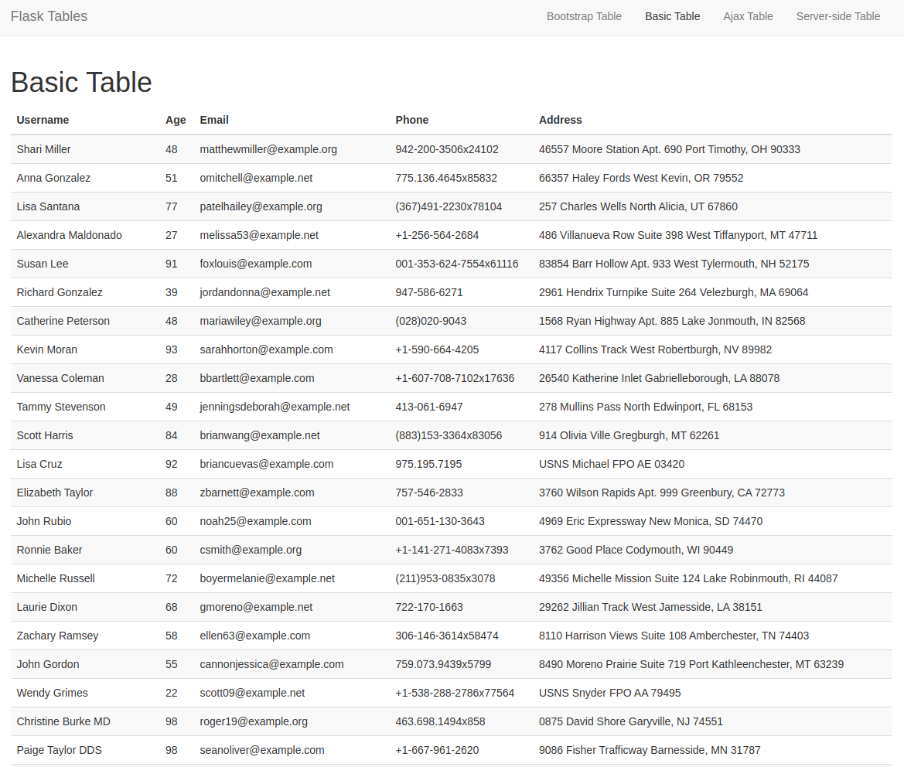
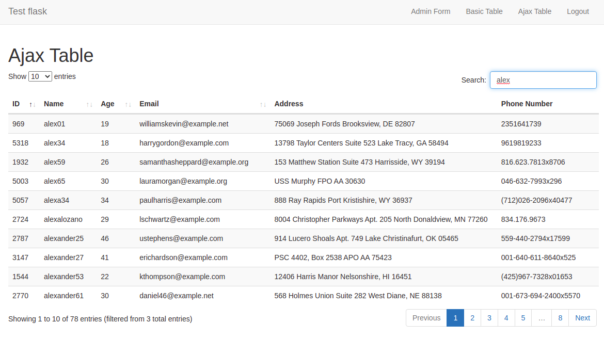

# Beautiful and functional tables

I was quite worried about how I can create a table in [my personal blog]() and add table functionalities that will allow me to quickly access any particular data. In the case where the data in the tables is too large, the addition of pagination was extremely necessary. Also, loading the data in the table as efficiently as possible would help improve the experience of working with my blog application.

## Features

- [x] Pagination of data in rows
    * Choose the number of rows to be displayed in the table
- [x] Searching of data in the entire table 
    * The application can search the entire table for a specific word or phrase (slow and not efficient as seen the Basic Table example)
    * The application can search for a specific word or phrase per the paginated data (fast and efficient as seen the Ajax Table example)
- [x] Sorting of data in the entire table
    * The application can sort the entire table by a specific column (You can choose what column to sort by during development)

## Technologies Used

- [x] Flask framework
- [x] Python for programming (front-end and back-end)
- [x] SQLAlchemy for the database
- [x] [Bootstrap](https://getbootstrap.com/) for the beautiful table
- [x] jQuery for the front-end
- [x] [dataTables.js](https://datatables.net//) library to enhance the table
- [x] [Faker](https://faker.readthedocs.io/en/master/) to generate fake user data
- [x] AJAX for the front-end

Additional technologies used:

- [x] Flask login for authentication
- [x] Flask-WTF for forms
- [x] Flask-Migrate for database migrations

### Basic Table

The basic table is a table that displays all the data in the database. I call it basic in the sense that it is quite good for the purposes of displaying short data. However, it is not very efficient as it is slow to load extremely large data. 

The biggest shortcoming of the basic table, which simply shows all the user data in our database, is that, for a few seconds on page load, this table will display the entire table before pagination kicks in. In the event that the data is too large, a user will have to patiently wait as the route 'does its thing' before the actual final table is displayed.

###### Table when the page is loading for the first few seconds:

###### Table when the page is fully loaded:

### Ajax Table

The use of Ajax helps to solve this problem. The table is loaded in chunks of data, which is then displayed on the screen. Also, searching is conviniently done on the server side. This improves the performance of the application. A user can search for a specific word or phrase in the entire table in an instant, without waiting for several seconds for Python to load the searched data.

