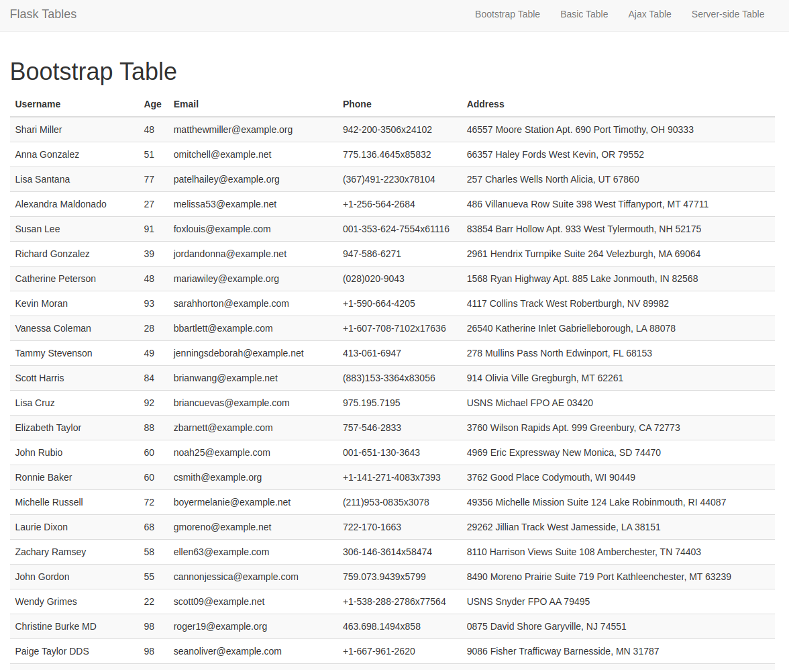
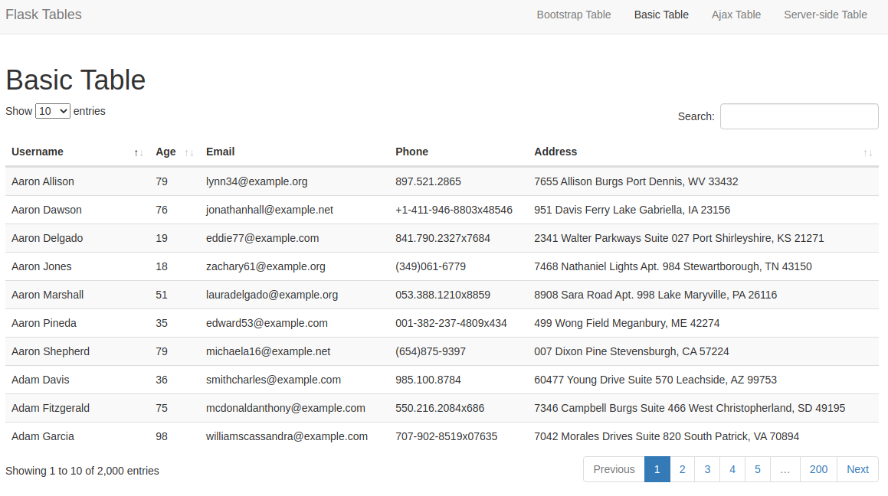
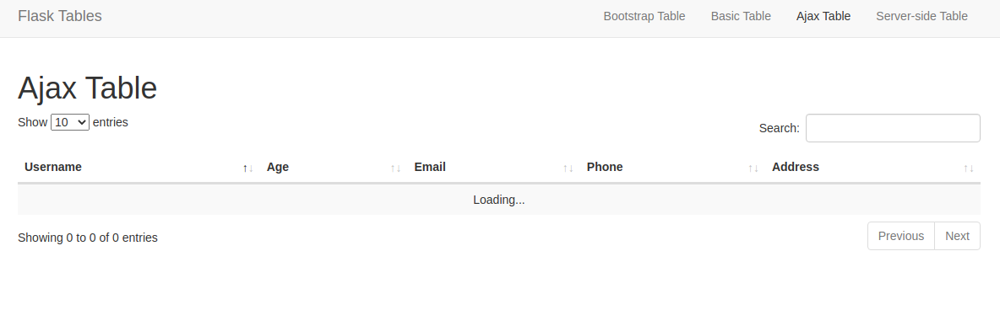
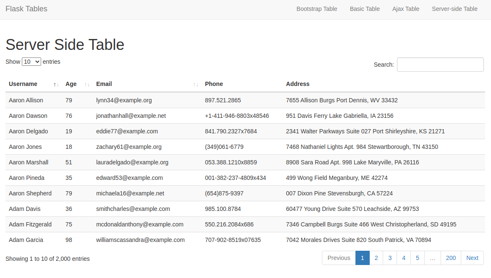

# Beautiful and Functional Flask Tables using DataTables.js


I was quite worried about how I can create a table in [my personal blog]() and add table functionalities that will allow me to quickly access any particular data. In the case where the data in the tables is too large, the addition of pagination was extremely necessary. Also, loading the data in the table as efficiently as possible would help improve the experience of working with my blog application.


## Features

- [x] Pagination of data in rows
    * Choose the number of rows to be displayed in the table
- [x] Searching for data in the entire table 
    * The application can search the entire table for a specific word or phrase (slow and not efficient as seen the Basic Table example)
    * The application can search for a specific word or phrase per the paginated data (fast and efficient as seen the Ajax Table example)
- [x] Sorting of data in the entire table
    * The application can sort the entire table by a specific column (You can choose what column to sort by during development)

## Technologies Used

- [x] Flask framework
- [x] Python for programming (front-end and back-end)
- [x] SQLAlchemy for the database
- [x] [Bootstrap](https://getbootstrap.com/) for the beautiful table
- [x] jQuery for the front-end
- [x] [dataTables.js](https://datatables.net//) library to enhance the table
- [x] [Faker](https://faker.readthedocs.io/en/master/) to generate fake user data
- [x] AJAX for the front-end
- [x] Heroku for Deployment
- [x] Docker for Deployment

## Types of Tables on Display

1. [Bootstrap Table](#bootstrap-table)
2. [Basic Table](#basic-table)
3. [Ajax Table](#ajax-table)
4. [Server-side Table](#server-side-table)

### Bootstrap Table

Creating a table in flask is very easy. All you need to do is define a table structure and display all the users in the table.




### Basic Table

The basic table is a table that displays all the data in the database, just like the bootstrap table. I call it basic in the sense that it is quite good for the purposes of displaying short data. However, it is not very efficient displaying large data. 

The biggest shortcoming of the basic table, which simply shows all the user data in our database, is that, for a few seconds on page load, this table will display the entire table before pagination kicks in. In the event that the data is too large, a user will have to patiently wait as the route 'does its thing' before the actual final table is displayed.

#### Table when the page is loading for the first few seconds


#### Table when the page is fully loaded



### Ajax Table

The use of Ajax helps to solve the problem faced by the basic table. Here, the table is first loaded empty when the request to access the ajax table is made. A second endpoint is used to display the data in the table. However, there is still a slight problem with this table. If the data is too large, the table will be empty for a few seconds before the actual data is displayed. This is because the entire table has to be loaded first, and this may take time depending on the size of the data.

#### Ajax Table when the page is loading for the first few seconds



#### Ajax Table when the page is fully loaded


### Server-side Table

With the server-side table, all features such as pagingaion, searching, and sorting are implemented on the server side. This is a very efficient way to display large data. When a request for the paginated server-side table is made, only the data found in the particular page will be displayed. If a user navigates to another page, then a new request for the data in the next page will be made. As such, only needed data is loaded and displayed. It is a better solution but it is a bit more involved to implement. Features such as searching and sorting have to be moved from the client side to the server side. 



### Using DataTables.js

- Add the CSS file in the `head` block:

    ```css
    <link rel="stylesheet" type="text/css" href="https://cdn.datatables.net/1.10.25/css/dataTables.bootstrap5.css">
    ```
- Then, update the `scripts` block to include the DataTables.js library

    ```js
    <script type="text/javascript" charset="utf8" src="https://code.jquery.com/jquery-3.6.0.min.js"></script>
    <script type="text/javascript" charset="utf8" src="https://cdn.datatables.net/1.10.25/js/jquery.dataTables.js"></script>
    <script type="text/javascript" charset="utf8" src="https://cdn.datatables.net/1.10.25/js/dataTables.bootstrap5.js"></script>
    ```


### Testing

If you are interested in testing the application, you can use the following commands to run the application:

1. Clone this repository:

    `$ git clone git@github.com:GitauHarrison/beautiful-flask-tables.git`
    <br>

2. Change directory to access the application:

    `$ cd beautiful-flask-tables`
    <br>

3. Create and activate the virtual environment:

    `$ mkvirtualenv flask-tables`
    <br>

4. Install dependencies:

    `$ pip3 install -r requirements.txt`
    <br>
5. Run the application:

    `$ flask run`
    <br>
6. Open the application in your browser running on local port 5000:

    - [x] [Chrome](http://127.0.0.1:5000/)
    - [x] [Firefox](http://127.0.0.1:5000/)
    - [x] [Safari](http://127.0.0.1:5000/)

### Reference

- [Interactive Flask Templates](https://blog.miguelgrinberg.com/post/beautiful-interactive-tables-for-your-flask-templates) - Miguel Grinberg
- [Beautiful Flask Tables](https://github.com/GitauHarrison/notes/blob/master/flask_tables/flask_tables.md) - me

### Going Further

The use of JQuery is currently obsolete. This makes DataTables.js outdated because it relies on JQuery. Check out the updated version of this project [here](https://github.com/GitauHarrison/notes/blob/master/flask_tables/gridjs.md) where I show how to work with Grid.js.